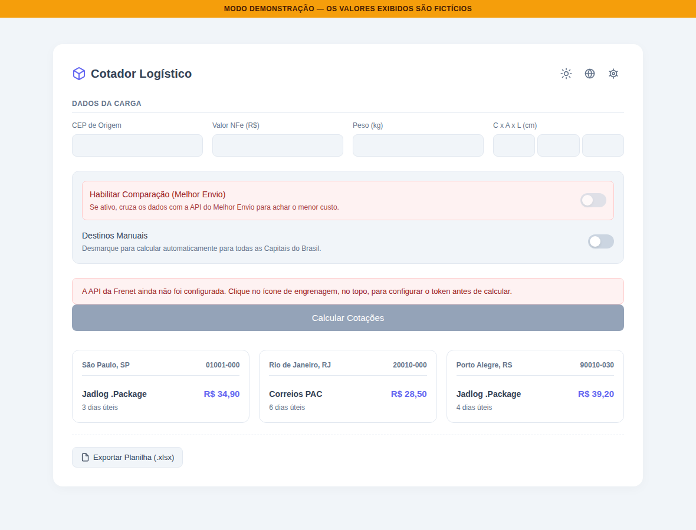

# 📦 Cotador Logístico

Aplicativo desktop desenvolvido para **comparar cotações de frete entre Frenet e Melhor Envio**, permitindo analisar múltiplas rotas simultaneamente e identificar as melhores opções de **preço e prazo**.

O projeto nasceu de uma necessidade real da operação comercial: reduzir o tempo gasto em consultas manuais e transformar a análise de frete em um processo mais rápido, visual e padronizado.

<p align="center">
  
</p>

## 🚀 Principais recursos

* **Cotação em lote** para as 27 capitais brasileiras ou CEPs personalizados
* **Comparação Frenet × Melhor Envio** por preço e prazo
* **Modo demonstração** com dados fictícios para apresentações
* **Exportação para Excel (.xlsx)**
* **Exportação de gráficos (.png)**
* **Português, Espanhol e Inglês**
* **Conversão de moeda** para BRL, USD e MXN
* **Tema claro e escuro**
* **Configuração de APIs pela interface**
* **Logs para diagnóstico e suporte**

## 🛠️ Stack

**Backend**

* C#
* .NET 8
* ASP.NET Core / Kestrel
* Serilog

**Desktop**

* WinForms
* WebView2

**Frontend**

* HTML
* CSS
* JavaScript
* Chart.js
* SheetJS

**Qualidade e entrega**

* xUnit
* Git
* GitHub Actions
* CI/CD

## 🏗️ Arquitetura

O projeto utiliza uma arquitetura em camadas, separando a interface desktop da lógica de negócio e das integrações externas.

```text
CotadorLogistico.App
        │
        ▼
CotadorLogistico.Core
   ┌────┼────┐
   ▼    ▼    ▼
Frenet  Melhor Envio  Configurações
   │         │
   └────┬────┘
        ▼
   Serviços externos
```

A aplicação utiliza um **servidor HTTP local** para intermediar a comunicação entre a interface e as APIs externas, mantendo as integrações e credenciais fora do JavaScript do frontend.

## 🔐 Segurança

As credenciais das APIs não são armazenadas no código-fonte nem expostas ao frontend.

Os tokens são armazenados localmente em:

```text
%APPDATA%\CotadorLogistico\settings.json
```

O aplicativo também possui um **Modo Demonstração**, permitindo realizar apresentações sem utilizar credenciais reais.

## 🧪 Testes

O projeto possui testes automatizados com **xUnit** para validar principalmente:

* Persistência das configurações
* Headers de autenticação
* URLs das APIs
* Comportamento dos proxies de integração

As chamadas de API são simuladas durante os testes, evitando dependência de serviços externos.

## ⚙️ Executando localmente

### Pré-requisitos

* Windows 10/11
* .NET 8 SDK

### Execução

```bash
git clone <url-do-repositorio>

cd cotador-logistico

dotnet run --project CotadorLogistico.App
```

Na primeira execução, configure as credenciais das APIs pela tela de **Configurações** ou utilize:

```text
--demomode
```

para executar uma demonstração completa sem credenciais reais.

## 📦 Build

Para gerar o executável:

```bash
dotnet publish CotadorLogistico.App \
  -c Release \
  -r win-x64 \
  --self-contained true \
  -p:PublishSingleFile=true
```

O projeto também possui **GitHub Actions** para automatizar build e testes a cada alteração no repositório.

---

### 📌 Objetivo

Mais do que um comparador de fretes, o Cotador Logístico foi desenvolvido como uma solução para um problema real da operação, unindo **automação, integração de APIs, análise de dados e experiência de usuário** em uma única aplicação.

**Desenvolvido por hyak :)))**